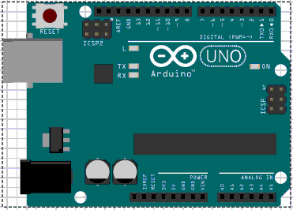
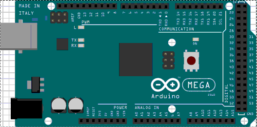

# Hello Arduino
Getting a “Hello World” with the GNU GCC toolchain, for times when the Arduino libraries get in the way.  

## Uno


Full instructions: [hello_uno.pdf](uno/doc/hello_uno.pdf)

```
# build
git clone https://github.com/dsnider0909/hello_arduino.git
cd hello_arduino/uno
make
```

## Mega



Full instructions: [hello_mega.pdf](mega/doc/hello_mega.pdf)


```
# build
git clone https://github.com/dsnider0909/hello_arduino.git
cd hello_arduino/mega
make
```

### Other interesting C tutorials on Arduinos

- [Program Arduino with AVR-GCC](http://www.javiervalcarce.eu/wiki/Program_Arduino_with_AVR-GCC)
- [Programming the Arduino in Pure C](http://canthack.org/2010/12/programming-the-arduino-in-pure-c/)
- [Arduino in C](https://balau82.wordpress.com/arduino-in-c/)
- [Arduino and GCC, compiling and uploading programs using only makefiles](https://www.ashleymills.com/node/327)
- [Arduino: Under the Hood](https://www.sparkfun.com/news/1810)
